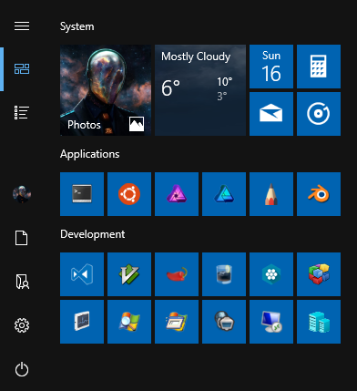

# Windows 10
Installation and configuration instructions for Windows 10 Creators Update (Version 1703).

Set the BIOS date two days in the past before installing and correct it after time and time zone selection.

## Installation
Download the latest [Windows 10](https://www.microsoft.com/en-us/software-download/windows10ISO) image and create a USB stick.

Create the file `\sources\ei.cfg` on the USB stick.

```ini
[EditionID]
Professional
[Channel]
Retail
[VL]
0
```

Create the file `\sources\pid.txt` on the USB stick.

```ini
[PID]
Value={windows key}
```

Keep the system disconnected from the network during the following steps.

## Hostname
Change the hostname.

```
Settings > System > About > Rename PC
```

Reboot the system.

Open a new PowerShell window with administrator privileges to change the NetBIOS name.

```cmd
$MethodDefinition = @'
[DllImport("kernel32.dll", CharSet = CharSet.Unicode)]
public static extern bool SetComputerName(string name);
'@
$Kernel32 = Add-Type -MemberDefinition $MethodDefinition -Name 'Kernel32' -Namespace 'Win32' -PassThru
$Kernel32::SetComputerName("{hostname}");
```

Reboot the system.

## Cortana
Configure Cortana using the search box in the taskbar.

## Group Policy
Configure group policies (skip unwanted steps).

```
gpedit.msc > Computer Configuration > Administrative Templates > Windows Components

Data Collection and Preview Builds
+ Allow Telemetry: Disabled

OneDrive
+ Prevent the usage of OneDrive for file storage: Enabled

Search
+ Do not allow web search: Enabled

Store
+ Turn off the Store application: Enabled

Windows Defender Antivirus
+ Turn off Windows Defender Antivirus: Enabled

Windows Defender Antivirus > MAPS
+ Join Microsoft MAPS: Disabled

Windows Defender Antivirus > Network Inspection System
+ Turn on definition retirement: Disabled
+ Turn on protocol recognition: Disabled

Windows Defender Antivirus > Real-time Protection
+ Turn off real-time protection: Enabled

Windows Defender Antivirus > Signature Updates
+ Allow definition updates from Microsoft Update: Disabled

Windows Defender Application Guard
+ Turn On/Off Windows Defender Application Guard (WDAG): Disabled

Windows Defender SmartScreen > Explorer
+ Configure App Install Control: Disabled
+ Configure Windows Defender SmartScreen: Disabled

Windows Defender SmartScreen > Microsoft Edge
+ Configure Windows Defender SmartScreen: Disabled

Windows Error Reporting
+ Disable Windows Error Reporting: Enabled

Windows Update
+ Configure Automatic Updates: Enabled
  Configure automatic updating: 2 - Notify for download and auto install
```

## Disk Optimizations
Verify that TRIM support is enabled. The following command should return `NTFS DisableDeleteNotify = 0`.

```cmd
fsutil behavior query disabledeletenotify
```

Disable disk defragmentation.

```
dfrgui > Change Settings
[ ] Run no a schedule (recommended)
```

Disable hibernation (not recommended for mobile computers).

```cmd
powercfg -h off
```

## Services
Delete diagnostics services.

```cmd
sc delete diagtrack
sc delete dmwappushservice
```

Disable unwanted services.

```
services.msc
+ Certificate Propagation: Manual -> Disabled
+ Geolocation Service: Manual -> Disabled
+ Microsoft (R) Diagnostics Hub Standard Collector Service: Manual -> Disabled
+ Microsoft Office Click-to-Run Service: Automatic -> Disabled
+ Superfetch: Automatic -> Disabled
+ Windows Biometric Service: Manual -> Disabled
+ Xbox Accessory Management Service: Manual -> Disabled
+ Xbox Live …: Manual -> Disabled
```

## Tasks
Disable Application Experience tasks.

```
Task Scheduler > Task Scheduler Library > Microsoft > Windows > Application Experience
+ Microsoft Compatibility Appraiser: Disabled
+ ProgramDataUpdater: Disabled
```

## Drivers & Updates
Disable automatic driver app installation.

```
Control Panel > "System" > Advanced system settings > Hardware > Device Installation Settings
(·) No (your device might not work as expected)
```

Configure Windows Update options and sources.

```
Settings > Update & security > Advanced options
[✓] Give me updates for other Microsoft products when I update Windows.
[✓] Use my sign in info to automatically finish setting up my device after an update.
    <Chose how updates are delivered>
      Updates from more than one place: Off
```

Reboot the system.

Connect to the Internet.<br/>
Wait until the CPU/Network activity stops and there are no more entries under `Device Manager > Other devices`.<br/>
Reboot the system.<br/>

Install Windows updates.<br/>
Reboot the system.

## User Name
Change the full user name.

```cmd
lusrmgr.msc > Users > {user}
+ Full Name: {User Name}
```

## Settings
Use common sense in **Settings**, **Explorer Options** and **Indexing Optinos**.

Uninstall unwanted apps except "App Installer" and "OneDrive".

## Startup
Disable automatically started applications.

```
Task Manager > Startup
+ Microsoft OneDrive: Disabled
+ Windows Defender notification icon: Disabled
```

## Notifications
Disable unwanted notifications.

```
Control Panel > System and Security > Security and Maintenance
  [Turn off all messages about …]
```

## Windows Libraries
Move unwanted Windows libraries.

1. Right click on `%UserProfile%\Pictures\Camera Roll` and select `Properties`.<br/>
   Select the `Location` tab and set it to `%AppData%\Camera Roll`.
2. Right click on `%UserProfile%\Pictures\Saved Pictures` and select `Properties`.<br/>
   Select the `Location` tab and set it to `%AppData%\Saved Pictures`.
3. Right click on `%UserProfile%\Videos\Captures` and select `Properties`.<br/>
   Select the `Location` tab and set it to `%AppData%\Captures`.

Hide unwanted "This PC" links.

```cmd
rem Documents
reg add "HKEY_LOCAL_MACHINE\SOFTWARE\Microsoft\Windows\CurrentVersion\Explorer\FolderDescriptions\{f42ee2d3-909f-4907-8871-4c22fc0bf756}\PropertyBag" /v "ThisPCPolicy" /t REG_SZ /d "Hide" /f

rem Pictures
reg add "HKEY_LOCAL_MACHINE\SOFTWARE\Microsoft\Windows\CurrentVersion\Explorer\FolderDescriptions\{0ddd015d-b06c-45d5-8c4c-f59713854639}\PropertyBag" /v "ThisPCPolicy" /t REG_SZ /d "Hide" /f

rem Videos
reg add "HKEY_LOCAL_MACHINE\SOFTWARE\Microsoft\Windows\CurrentVersion\Explorer\FolderDescriptions\{35286a68-3c57-41a1-bbb1-0eae73d76c95}\PropertyBag" /v "ThisPCPolicy" /t REG_SZ /d "Hide" /f

rem Downloads
reg add "HKEY_LOCAL_MACHINE\SOFTWARE\Microsoft\Windows\CurrentVersion\Explorer\FolderDescriptions\{7d83ee9b-2244-4e70-b1f5-5393042af1e4}\PropertyBag" /v "ThisPCPolicy" /t REG_SZ /d "Hide" /f

rem Music
reg add "HKEY_LOCAL_MACHINE\SOFTWARE\Microsoft\Windows\CurrentVersion\Explorer\FolderDescriptions\{a0c69a99-21c8-4671-8703-7934162fcf1d}\PropertyBag" /v "ThisPCPolicy" /t REG_SZ /d "Hide" /f

rem Desktop
reg add "HKEY_LOCAL_MACHINE\SOFTWARE\Microsoft\Windows\CurrentVersion\Explorer\FolderDescriptions\{B4BFCC3A-DB2C-424C-B029-7FE99A87C641}\PropertyBag" /v "ThisPCPolicy" /t REG_SZ /d "Hide" /f
```

Hide unwanted "Explorer" links.

```cmd
rem OneDrive
reg add "HKEY_CLASSES_ROOT\CLSID\{018D5C66-4533-4307-9B53-224DE2ED1FE6}" /v "System.IsPinnedToNameSpaceTree" /t REG_DWORD /d 0 /f
```

## Firewall
Disable all rules in Windows Firewall keeping the following entries.

```
wf.msc
+ Inbound Rules
  + Connect
  + Core Networking - …
  + Delivery Optimization (…)
  + Hyper-V …
  + Network Discovery (…)
  + Remote Desktop - …
+ Outbound Rules
  + Connect
  + Core Networking - …
  + Hyper-V …
  + Network Discovery (…)
```

Enable inbound rules for "Remomte Desktop - …" if necessary.

Enable inbound rules for "File and Printer Sharing (Echo Request …)". Modify "Private,Public"
rules for inbound and outbound IPv4 and IPv6 Echo Requests and select "Any IP address" under
"Remote IP address" in the "Scope" tab.

To enable the WSL SSH Server, you need to replace the "SSH Server Proxy Service" inbound rule
with a new inbound rule for port 22.

## Keymap
Use this [keymap](keymap.zip) to input German characters on a U.S. keyboard.

## Microsoft Software
Uninstall unwanted applications in `Settings > Apps`.<br/>
Uninstall unwanted optional features in `Settings > Apps > Manage optional features`.

Configure [Microsoft Edge](https://en.wikipedia.org/wiki/Microsoft_Edge) after visiting <https://www.google.com/ncr>.

```
Settings
Open Microsoft Edge with: A specific page or pages
  about:blank
Open Microsoft Edge with: Previous pages
Open new tabs with: A blank page
[View advanced settings]
  Show the home button: Off
  Use Adobe Flas Player: Off
  Open sites in apps: Off
  Ask me what to do with each download: Off
  [Change search engine]
    Select: Google Search (discovered)
    [Set as default]
  Show search and site suggestions as I type: Off
  Let sites save protected media licenses on my device: Off
  Use page prediction to speed up browsing, …: Off
```

Configure [Internet Explorer](https://en.wikipedia.org/wiki/Internet_Explorer).

```
Internet options > General
Home page: about:blank
Startup: Start with tabs from the last session
```

Configure the Photos app.

```
Photos > Settings
Linked duplicates: Off
People: Off
Mouse wheel: Zoom in and out
```

## Windows Features
Enable or disable Windows features.

```
Control Panel > Programs > Turn Windows features on or off
[■] .NET Framework 3.5 (includes .NET 2.0 and 3.0)
[ ] Media Features
[ ] SMB 1.0/CIFS File Sharing Support
[✓] Windows Subsystem for Linux
[ ] XPS Services
[ ] XPS Viewer
```

## Fonts
Install useful fonts.

* [DejaVu & DejaVu LGC](https://sourceforge.net/projects/dejavu/files/dejavu)
* [DejaVu Sans Mono from Nerd Fonts](https://github.com/ryanoasis/nerd-fonts)
* [Iconsolata](http://www.levien.com/type/myfonts/inconsolata.html)
* [IPA](http://ipafont.ipa.go.jp)

## Third Party
Install third party software.

* [7-Zip](http://www.7-zip.org)
* [ConEmu](https://conemu.github.io)
* [Affinity Photo](https://affinity.serif.com/photo)
* [Affinity Designer](https://affinity.serif.com/designer)
* [Sketchbook Pro](http://www.autodesk.com/products/sketchbook-pro/overview)
* [Sublime Text 3](https://www.sublimetext.com/)
* [gVim](http://www.vim.org)
* [CMake](https://cmake.org)
* [NASM](http://www.nasm.us)
* [HxD](https://mh-nexus.de/en/hxd)
* [CFF Explorer](http://www.ntcore.com/exsuite.php)
* [Resource Hacker](http://www.angusj.com/resourcehacker)
* [Sysinternals Suite](https://technet.microsoft.com/en-us/sysinternals/bb842062.aspx)

Configure Sublime Text 3 after installing the [Visual Studio Dark](https://packagecontrol.io/packages/Visual%20Studio%20Dark) theme.

```json
{
  "color_scheme": "Packages/Visual Studio Dark/Visual Studio Dark.tmTheme",
  "close_windows_when_empty": true,
  "ensure_newline_at_eof_on_save": true,
  "font_face": "DejaVu LGC Sans Mono",
  "font_size": 9,
  "hot_exit": false,
  "ignored_packages": [ "Markdown", "Vintage" ],
  "open_files_in_new_window": false,
  "rulers": [ 120 ],
  "show_definitions": false,
  "tab_size": 2,
  "theme": "Default.sublime-theme",
  "translate_tabs_to_spaces": true,
  "caret_extra_bottom": 1,
  "caret_extra_top": 1,
  "caret_extra_width": 1
}
```

Configure [Sublime Text 3 MarkdownEditing GFM Settings](https://packagecontrol.io/packages/MarkdownEditing) (optional).

```json
{
  "color_scheme": "Packages/Visual Studio Dark/Visual Studio Dark.tmTheme",
  "trim_trailing_white_space_on_save": true,
  "draw_centered": false,
  "line_numbers": true,
  "word_wrap": false,
  "rulers": [ 120 ],
  "tab_size": 2
}
```

## Server
Install software for Windows Server administration.

* [SQL Server Management Studio](https://msdn.microsoft.com/en-us/library/mt238290.aspx)
* [Remote Server Administration Tools for Windows 10](https://www.microsoft.com/en-us/download/details.aspx?id=45520)

Configure the WinRM client.

```cmd
Get-NetConnectionProfile
Set-NetConnectionProfile -InterfaceIndex {Idx} -NetworkCategory Private
Set-Item WSMan:\localhost\Client\TrustedHosts -Value "*" -Force
```

*See comments in this readme file for Windows Server configuration.*

<!--
Configure the WinRM server.

```ps
Enable-PSRemoting -SkipNetworkProfileCheck -Force
Set-NetFirewallRule -Name "WINRM-HTTP-In-TCP-PUBLIC" -RemoteAddress Any
Set-Item WSMan:\localhost\Client\TrustedHosts -Value "*" -Force
```

Configure the WinRM server to accept HTTPS connections.

```ps
winrm enumerate winrm/config/listener
New-SelfSignedCertificate -DnsName "{DomainName}" -CertStoreLocation Cert:\LocalMachine\My
cmd /C 'winrm create winrm/config/Listener?Address=*+Transport=HTTPS @{Hostname="{DomainName}"; CertificateThumbprint="{Thumbprint}"}'
netsh advfirewall firewall add rule name="Windows Remote Management (HTTPS-In)" dir=in action=allow protocol=TCP localport=5986
```

Connect over HTTP.

```ps
Enter-PSSession -ComputerName host.domain -Port 5985 -Credential administrator@domain
```

Connect over HTTPS.

```ps
$soptions = New-PSSessionOption -SkipCACheck
Enter-PSSession -ComputerName host.domain -Port 5986 -Credential administrator@domain -SessionOption $soptions -UseSSL
```
-->

## Control Panel
Add Control Panel shortcuts to the Windows start menu (use icons from `C:\Windows\System32\shell32.dll`).

[Control Panel Command Line Commands](https://www.lifewire.com/command-line-commands-for-control-panel-applets-2626060)

## Windows Subsystem for Linux
Install [WSLtty](https://github.com/mintty/wsltty) for better terminal support.<br/>
Install [VcXsrv](https://github.com/ArcticaProject/vcxsrv/releases) for Xorg application support.

Fix `/etc/localtime` symlink.

```sh
rm /etc/localtime
ln -s /usr/share/zoneinfo/Europe/Berlin /etc/localtime
echo Europe/Berlin > /etc/timezone
```

Add the following line to `/etc/mdadm/mdadm.conf` (fixes some `apt` warnings).

```sh
ARRAY <ignore> devices=/dev/sda
```

Modify the following lines in `/etc/pam.d/login` (disables message of the day).

```sh
#session    optional    pam_motd.so motd=/run/motd.dynamic
#session    optional    pam_motd.so noupdate
```

Configure [sudo(8)](http://manpages.ubuntu.com/manpages/xenial/man8/sudo.8.html) with `sudo EDITOR=vim visudo`.

```sh
# Locale settings.
Defaults env_keep += "LANG LANGUAGE LINGUAS LC_* _XKB_CHARSET"

# Profile settings.
Defaults env_keep += "MM_CHARSET EDITOR PAGER CLICOLOR LSCOLORS TMUX SESSION"

# User privilege specification.
root  ALL=(ALL) ALL
%sudo ALL=(ALL) NOPASSWD: ALL

# See sudoers(5) for more information on "#include" directives:
#includedir /etc/sudoers.d
```

Install packages.

```sh
sudo apt update
sudo apt upgrade
sudo apt dist-upgrade
sudo apt autoremove
sudo apt install apt-file p7zip-full p7zip-rar zip unzip tree htop imagemagick librsvg2-bin wrk
sudo apt-file update
```

Install development packages.

```sh
sudo apt install build-essential ninja-build nasm git subversion nodejs npm swig openjdk-9-jdk-headless
sudo apt install binutils-dev zlib1g-dev libpng-dev libfreetype6-dev libssl-dev libcurl4-openssl-dev
sudo apt install python3-dev libpython3-dev libxml2-dev libncurses-dev libcableswig-dev libgtest-dev
sudo ln -s /usr/bin/nodejs /usr/bin/node
```

Install CMake.

```sh
rm -rf /opt/cmake; mkdir /opt/cmake
wget https://cmake.org/files/v3.9/cmake-3.9.4-Linux-x86_64.tar.gz
tar xvzf cmake-3.9.4-Linux-x86_64.tar.gz -C /opt/cmake --strip-components 1
```

Build GTest libraries.

```sh
mkdir gtest && cd gtest && CC=clang CXX=clang++ cmake /usr/src/gtest && make && sudo cp *.a /usr/lib/
```

Modify the following lines in `/etc/ssh/sshd_config` (replace `{username}` with your WSL username).

```sh
Protocol 2
HostKey /etc/ssh/ssh_host_rsa_key
#HostKey /etc/ssh/ssh_host_dsa_key
#HostKey /etc/ssh/ssh_host_ecdsa_key
#HostKey /etc/ssh/ssh_host_ed25519_key
UsePrivilegeSeparation yes
AllowUsers {username}
UseDNS no
```

Create a new RSA key.

```sh
sudo ssh-keygen -t rsa -f /etc/ssh/ssh_host_rsa_key
sudo chmod 600 /etc/ssh/ssh_host_rsa_key
```

Start the server.

```sh
sudo service ssh start
sudo service ssh status
```

## Start Menu


Possible fix for a broken Start Menu: Enable and log in with the built-in Administrator account.

```cmd
rd /Q /S C:\Users\{Name}\AppData\Local\Packages\Microsoft.Windows.Cortana_cw5n1h2txyewy
```
