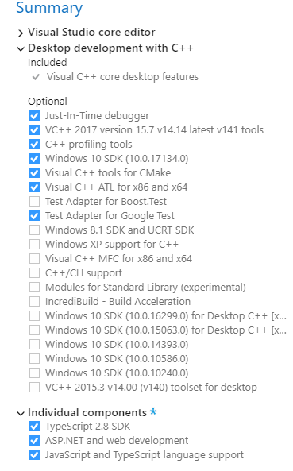

## Visual Studio 2017
Install Visual Studio 2017 Community for native C++ development and casual JavaScript editing.



## Environment
Set the `Path` environment variable.

```
%SystemRoot%\System32
%SystemRoot%
%SystemRoot%\System32\Wbem
%SystemRoot%\System32\WindowsPowerShell\v1.0
%ProgramFiles(x86)%\Microsoft Visual Studio\2017\Community\Web\External
%ProgramFiles%\CMake\bin
%ProgramFiles%\Git\cmd
%ProgramFiles%\NASM
%ProgramFiles%\7-Zip
```

Set the `NODE_PATH` environment variable.

```
%ProgramFiles(x86)%\Microsoft Visual Studio\2017\Community\Web\External\node_modules
```

Update the node configuration file.

```cmd
@echo prefix=C:\Program Files (x86)\Microsoft Visual Studio\2017\Community\Web\External > %UserProfile%\.npmrc
```

## Configuration
Start Visual Studio 2017, log in using a Microsoft account and let Visual Studio synchronize settings.

```
Tools > Options
Environment
+ Documents
  [✓] Detect when file is changed outside the environment
      [✓] Reload modified files unless there are unsaved changes
  [✓] Save documents as Unicode when data cannot be saved in codepage
+ Fonts and Colors
  Text Editor: DejaVu LGC Sans Mono 9
  Printer and Cut/Copy: Iconsolata 10
  [All Text Tool Windows]: DejaVu LGC Sans Mono 9
+ Quick Launch
  [ ] Enable Quick Launch
+ Startup
  At startup: Show empty environment
Projects and Solutions
+ General
  Lightweight Solution Load: Disable
  [ ] Warn user when the project location is not trusted
+ Build and Run
  On Run, when projects are out of date: Always build
  On Run, when build or deployment error occur: Do not launch
Source Control
+ Plug-in Selection
  Current source control plug-in: Git
Text Editor
+ General
  [ ] Highlight current line
+ All Languages
  + General
    [✓] Line numbers
  + Scroll Bars
    (•) Use map mode for vertical scroll bar
        [ ] Show Preview Tooltip
        Source overview: Wide
  + Tabs
    Indenting: Smart
    Tab size: 2
    Indent size: 2
    (•) Indent spaces
+ C/C++
  + Formatting
    + Indentation
      [ ] Indent namespace contents
      [✓] Preserve indentation of comments
    + New Lines
      Position of open braces for namespaces: Keep on the same line, but add a space before
      Position of open braces for types: Keep on the same line, but add a space before
      Position of open braces for functions: Don't automatically reposition
      Position of open braces for control blocks: Keep on the same line, but add a space before
      Position of open braces for lambdas: Keep on the same line, but add a space before
      [✓] Place braces on separate lines
      [✓] For empty types, move closing braces to the same line as opening braces
      [✓] For empty function bodies, move closing braces to the same line as opening braces
      [ ] Place 'else' on a new line
    + Wrapping
      (•) Always apply New Lines settings for blocks
  + View
    + Outlining
      Enable Outlining: False
+ CSS
  + Advanced
    Color picker format: #000
    Automatic formatting: Off
+ JavaScript/TrueScript
  + Formatting
    + General
      [ ] Format completed line on Enter
      [ ] Format completed statement on ;
    + Spacing
      [ ] Insert space after function keyword for anonymous functions
```

## Resource Compiler Bugfix
Copy resource compiler DLL from an installed Windows SDK to the default location.

```cmd
copy "%ProgramFiles(x86)%\Windows Kits\10\bin\10.0.15063.0\x86\rcdll.dll" "%ProgramFiles(x86)%\Windows Kits\10\bin\x86\rcdll.dll"
```

## Trailing Whitespace Visualizer
<https://marketplace.visualstudio.com/items?itemName=MadsKristensen.TrailingWhitespaceVisualizer>

## Line Endings Unifier
<https://marketplace.visualstudio.com/items?itemName=JakubBielawa.LineEndingsUnifier>

```
Tools > Options
Line Endings Unifier
+ General Settings
  Add Newline On The Last Line: True
  Default Line Ending: Linux
  Force Default Line Ending On Document: True
  Save Files After Unifying: True
  Supported File Formats: .c; .cc; .cpp; .h; .hh; .hpp; .in; .js; .html; .md; .sh; .conf; .txt
  Supported File Names: makefile
```

## Google Test Adapter
<https://marketplace.visualstudio.com/items?itemName=ChristianSoltenborn.GoogleTestAdapter>

```
Tools > Options
Environment
+ Keyboard
  TestExplorer.RunAllTests: F6 (Global)
```

## VCPKG
Install Visual Studio package manager.

```cmd
mkdir C:\Libraries
cd C:\Libraries && git clone https://github.com/Microsoft/vcpkg
cd vcpkg && bootstrap-vcpkg.bat && vcpkg integrate install && exit
```

Add `C:\Libraries\vcpkg` and `C:\Libraries\vcpkg\installed\x64-windows-static\bin` to the `PATH` environment variable.<br/>
Set the `VCPKG` environment variable to `C:/Libraries/vcpkg/scripts/buildsystems/vcpkg.cmake`.<br/>
Set the `VCPKG_DEFAULT_TRIPLET` environment variable to `x64-windows-static`.

```cmd
vcpkg install angle bzip2 curl fmt freetype gtest libjpeg-turbo libpng libssh2 openssl zlib
```

NOTE: If openssl fails because of a hash mismatch, save the [this][sbp] file to `C:\Libraries\vcpkg\downloads`.

Configure CMake projects with the following command:

```cmd
cmake -G "Visual Studio 15 2017 Win64" -DCMAKE_CONFIGURATION_TYPES="Release;Debug" ^
  -DCMAKE_TOOLCHAIN_FILE=%VCPKG% -DVCPKG_TARGET_TRIPLET=%VCPKG_DEFAULT_TRIPLET%
```

[sbp]: http://strawberryperl.com/download/5.24.1.1/strawberry-perl-5.24.1.1-32bit-portable.zip
